Note - this work is a fork and adaptation of Fatih Nar's repo: https://github.com/fenar/cnvopen5gcore

# Distributed 5G Core using Skupper on Red Hat Openshift

The goal is to distribute the user plane and have the control plane centralized. As such, we have two clusters, one containing SMF and UPF, and the other one containing the rest of the 5G Core.

In the central location, called `local-cluster` or `ca-central`, we will expose all the 5G Core Network Functions, but SMF.
In the remote location, called `ca-regina`, we will expose the SMF and deploy the UPF.

At the end, oce the call flow is established, you can visualize the overall SBI interaction, as depicted here
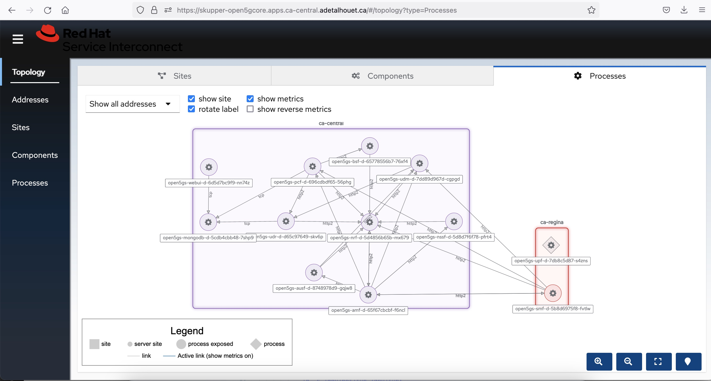


## Prerequisites

- OpenShift 4.12
- Advanced Cluster Management 2.7
- OpenShift GitOps on the cluster where ACM is
- Two clusters that are imported into ACM (can be the local-cluster and another one)
- SCTP enabled on both clusters
    ```
    oc create -f enablesctp.yaml
    ```
    Wait for machine config to be applied on all worker nodes and all worker nodes come back in to ready state.

## Multi-cluster setup

### Create a managed cluster set

In order to manage the various K8S clusters, we create a `ManagedClusterSet` called **5g-core** in Red Hat Advanced Cluster Management. To add clusters in this clusterSet, we need to add the following label `cluster.open-cluster-management.io/clusterset=5g-core` to the `ManagedClusters` to import.

This clusterSet is then bound to a specific namespace, using a `ManagedClusterSetBinding`. This allows ACM to take action in these clusters through that namespace. In our case, we will bound the clusterSet to `openshift-gitops` namespace, as this is where we will deploy ArgoCD ApplicationSet.

Apply the following

~~~
oc apply -f managed-cluster-set.yaml
oc label managedcluster ca-regina cluster.open-cluster-management.io/clusterset=5g-core
oc label managedcluster local-cluster cluster.open-cluster-management.io/clusterset=5g-core
~~~

This is the result in RHACM


[Find more information about ManagedClusterSet](https://access.redhat.com/documentation/en-us/red_hat_advanced_cluster_management_for_kubernetes/2.4/html/clusters/managing-your-clusters#creating-a-managedclusterset)

### Import the managed clusters into ArgoCD

Now that we created the grouping of clusters to work with, let's import them in ArgoCD. Do to so, we need to create a `GitOpsCluster` that will define where is the ArgoCD to integrate with, along with the `Placement` rule to use. In our case, we will use the clusterSet `5g-core` to denote clusters that should be imported.

Apply the following

~~~
oc apply -f 5g-core-placement.yaml
oc apply -f gitopscluster.yaml
~~~

This is the result in ArgoCD

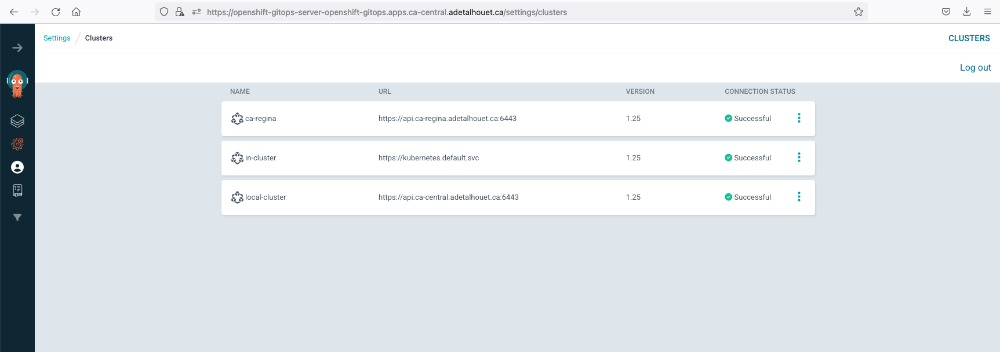

[Find more information about the integration of ACM with ArgoCD](https://access.redhat.com/documentation/en-us/red_hat_advanced_cluster_management_for_kubernetes/2.4/html/applications/managing-applications#gitops-config)

## Deploy the Virtual Application Network

Skupper is the technology being used to interconnect the K8S clusters together, along with our database that resides in a bare metal server. 

[Find more information about Skupper here](https://skupper.io/).

### Site establishment

In order to deploy Skupper across all the 2 clusters, we will use an ArgoCD ApplicationSet. It will use the [clusterDecisionResource](https://argocd-applicationset.readthedocs.io/en/stable/Generators-Cluster-Decision-Resource/) generator and will use a `Placement` rule using the clusterSet `5g-core` to match clusters for which to generate an Application (created in the previous step).

To customize the manifest deployed in each site, we are using Kustomize with one overlay folder per cluster, matching the cluster name.

Both our clusters are supporting [Operator Lifecycle Manager](https://olm.operatorframework.io/), but if yours isn't, we have two methods of deploying Skupper site controller: one using the [Skupper operator](skupper/base/operator), one using the [manifests](skupper/base/site-controller).

The way to deploy [Skupper router](skupper/base/instance) is common to all site, and will be customized with the site name and site specific authentication method.

Apply the following

~~~
oc apply -f skupper/appset-skupper.yaml
~~~

This is the result in ArgoCD. It is expected the `skupper-local-cluster` ArgoCD Application shows out-of-sync, we will explain later why this is useful.
In each site, in the namespace `open5gcore` you should see the Skupper pod. At this point, there is no connectivity between the sites.

You should see this in ArgoCD
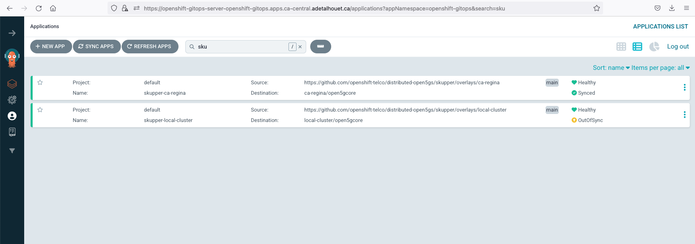

You should see this in ACM
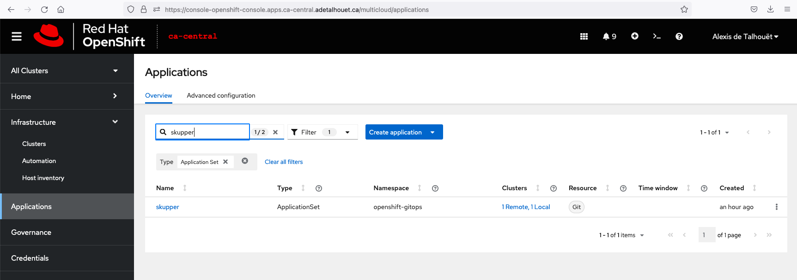

And you can browse to Skupper UI; retrieve the route using `oc get routes -n open5gcore skupper`

### mTLS establishment

Skupper rely on an mTLS to establish a Virtual Application Network. As such, it requires a `Secret` containing the certificate authority, the certificate and the key to be present in all sites.

To have Skupper populating the TLS data into a secret, we can simply create an empty secret with this label `skupper.io/type: connection-token-request`. Skupper site controller will populate all the required information in this secret automatically. In our example, the secret will be generated in the **ca-central**.

Given we are deploying the secret using GitOps, as soon as Skupper adds data into it, ArgoCD will report the secret out-of-sync. This is expected, and we purposely disabled `self-heal` in this ArgoCD Application because we do tolerate this out-of-sync. We will see later why it is very useful.

Once the TLS data exists, it needs to be provided to the other sites in order to setup the mTLS session. To do so, we will use an [RHACM Policy](skupper/overlays/local-cluster/link-to-central-policy.yaml) along with templating functions to copy the secret data over the remote sites. The policy will match clusters based on the `PlacementRule` defined; in our case, it is matching cluster with label `link-to-central: True`.

As defined in the policy, using the templating functions, the secret looks like this:
~~~
kind: Secret
apiVersion: v1
metadata:
    name: link-to-central
    namespace: open5gcore
    labels:
        skupper.io/type: connection-token
    annotations:
        edge-host: '{{hub ( index ( lookup "v1"  "Secret" "open5gcore" "link-to-central").metadata.annotations "edge-host" ) hub}}'
        edge-port: '443'
        inter-router-host: '{{hub ( index ( lookup "v1"  "Secret" "open5gcore" "link-to-central").metadata.annotations "inter-router-host" ) hub}}'
        inter-router-port: '443'
data:
    ca.crt: '{{hub ( index ( lookup "v1"  "Secret" "open5gcore" "link-to-central").data "ca.crt" ) hub}}'
    tls.key: '{{hub ( index ( lookup "v1"  "Secret" "open5gcore" "link-to-central").data "tls.key" ) hub}}'
    tls.crt: '{{hub ( index ( lookup "v1"  "Secret" "open5gcore" "link-to-central").data "tls.crt" ) hub}}'
type: Opaque
~~~

RHACM will render this policy and will place it in each cluster's namespace, based on the matched clusters. These generated policies are also the source of our `skupper-local-cluster` ArgoCD Application out-of-sync status. Again, this is expected, and we will see later why it is very useful.

Given we already deployed the Skupper ApplicationSet previously, let just add the label to have the secret containing the TLS information propageted to our two remote sites.
~~~
oc label managedcluster ca-regina link-to-central=True
~~~

This is the result you should observe in RHACM
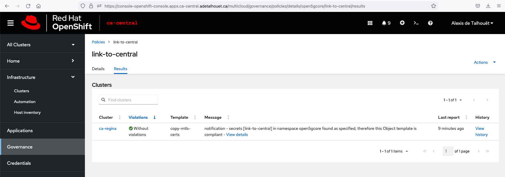

Now the two sites are connected within that namespace:
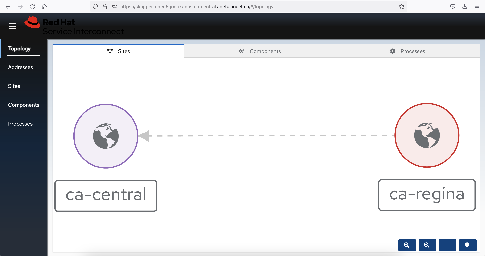

[Find more information about ACM Policy template](https://access.redhat.com/documentation/en-us/red_hat_advanced_cluster_management_for_kubernetes/2.4/html/governance/governance#hub-templates)

## Deploying Open5GS

The application is provided through a Helm chart, where all the various 5G Core Network Functions are defined. In order to specify which microservice will be deployed where, we have created site specific Values.yaml file, prefixed with the name of the site, identified using `{{cluster-name}}-values.yaml`.

Similarly as the Skupper site controller deployment, we are using an ApplicationSet that will use the same placement rule defined prior e.g. using label `5g-core: True`.


Apply the following to deploy the ApplicationSet

~~~
oc apply -f 5gcore/distributed-5gcore-acm-appset.yaml
~~~

Once the deployment is done, you should see the following in ACM
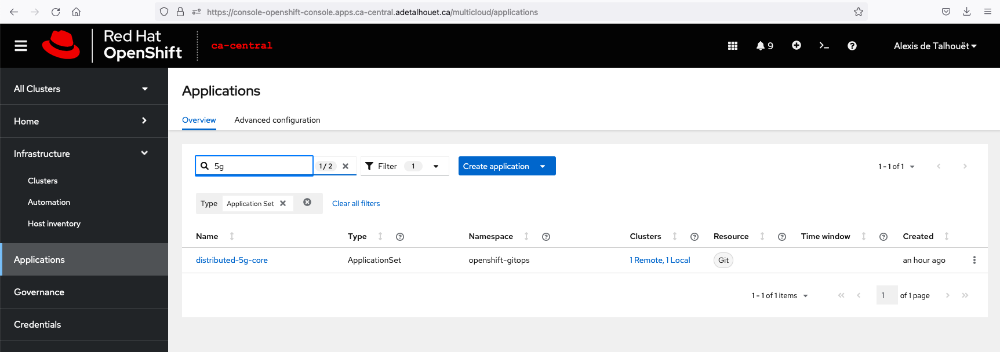

And in ArgoCD
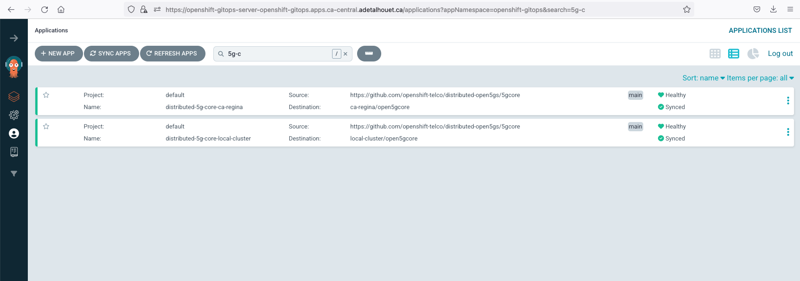


As part of the deployment, we are exposing services to Skupper to make them reachable through the L7 link created before.
As such, you should see the services discovered and exposed through Skupper Virtual Application Network
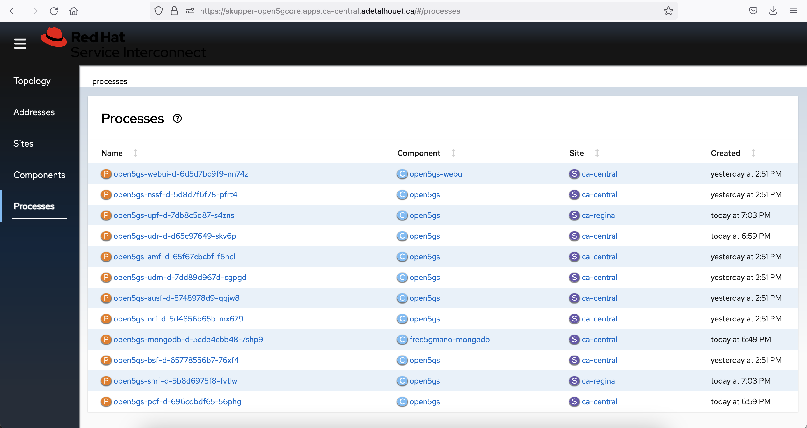

And by looking at the service interactions, we can see the distributed SMF connected to the NRF to register itself


## Provision the user equipment

The Open5GS project comes with a webui that allows you to register UE. As such, log in the UI to register the UE.

Retrieve the webui URL with `oc get route -n open5gcore webui` and login using the following credentials
- username: admin
- password: 1423

Click "Add new subscriber" and in the `IMSI` field enter `208930000000001`. The rest of the values have been configured automatically.


## Deploy the gNB and the UE

In order for the gNB to establish its SCTP session with AMF, it requires the AMF service IP. As such, update the values.yaml file in the 5gran folder.
It can be retrieved using
~~~
oc get service -n open5gcore amf-open5gs-sctp -o jsonpath={.spec.clusterIP}
~~~

Once updated properly, apply the below manifest to create the argo application OR
~~~
oc apply -f 5gran/5gran-app.yaml
~~~

OR Deploy the helm chart manually
~~~
helm install 5gran --kubeconfig ca-regina --namespace open5gran
~~~

Once deployed, look at the logs of gNB and UE to validate the PDU session has properly be established
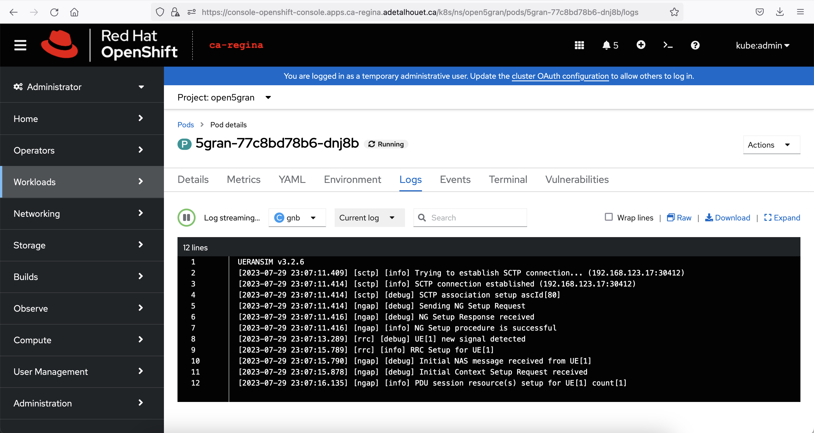


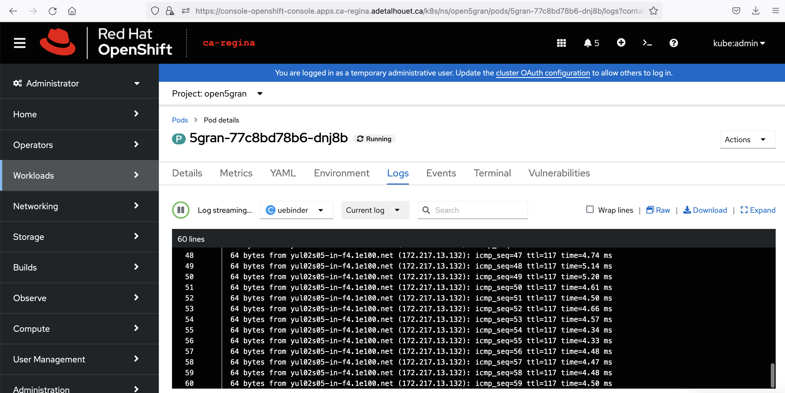


Finally, see bellow the overall interaction within Skupper


## Links
- https://open5gs.org/
- https://github.com/open5gs/open5gs
- https://github.com/aligungr/UERANSIM